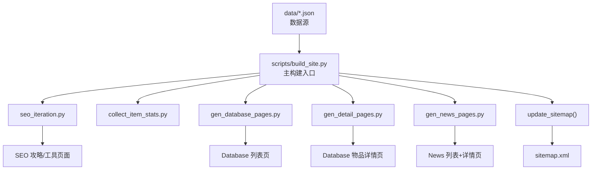
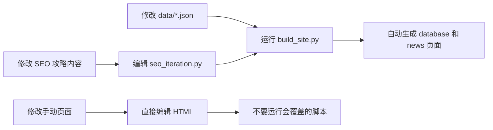

# Windrose 网站代码更新逻辑总结

## 构建流程概览

## 一、Python 脚本生成的页面（运行 `build_site.py` 后会覆盖）

> [!CAUTION]
> 这些页面由脚本生成，手动修改后再运行脚本会被**覆盖**。需要修改内容请改 `data/*.json` 或脚本本身。

### 1. `seo_iteration.py` — SEO 攻略页面（硬编码内容）

| 路径 | 页面内容 | 数据来源 |
|---|---|---|
| `/tools/index.html` | 工具 Hub 页 | 脚本硬编码 |
| `/tools/recipe-finder/index.html` | 配方查询页 | 脚本硬编码 |
| `/tools/progression-checklist/index.html` | 进度清单页 | 脚本硬编码 |
| `/tools/resource-planner/index.html` | 资源规划页 | 脚本硬编码 |
| `/tools/ship-selector/index.html` | 船只选择页 | 脚本硬编码 |
| `/server-guide/index.html` | 专用服务器指南 | 脚本硬编码 |
| `/download/index.html` | 下载与游戏信息 | 脚本硬编码 |
| `/sources/index.html` | 数据来源策略页 | 脚本硬编码 |
| `/crafting/alchemy/index.html` | 炼金配方 | 脚本硬编码 |
| `/crafting/cooking/index.html` | 烹饪配方 | 脚本硬编码 |
| `/crafting/building/index.html` | 建筑材料 | 脚本硬编码 |
| `/bosses/index.html` | Boss 追踪页 | 脚本硬编码 |
| `/news/index.html` | 新闻 Hub（被 gen_news_pages 二次覆盖） | 脚本硬编码 |
| `/guides/mining-routes/index.html` | 挖矿路线攻略 | 脚本硬编码 |
| `/guides/boss-progression/index.html` | Boss 进阶攻略 | 脚本硬编码 |
| `/guides/best-early-builds/index.html` | 早期最佳 Build | 脚本硬编码 |
| `/guides/ship-building-naval-combat/index.html` | 船只建造与海战 | 脚本硬编码 |
| `/guides/sailing-navigation/index.html` | 航行与导航 | 脚本硬编码 |
| `/guides/crafting-progression/index.html` | 制作进阶 | 脚本硬编码 |
| `/guides/coop-multiplayer/index.html` | 多人合作 | 脚本硬编码 |
| `/search/index.html` | 站内搜索页 | 脚本硬编码 |

> [!NOTE]
> `seo_iteration.py` 的内容**直接写在 Python 代码里**，不是从 `data/*.json` 读取的。要修改这些页面内容，需要编辑脚本本身。

### 2. `gen_database_pages.py` — 数据库列表页（从 JSON 生成）

| 路径 | 数据来源 |
|---|---|
| `/database/weapons/index.html` | `data/weapons.json` + `data/scraped_items_v2.json` |
| `/database/weapons/melee/index.html` | 同上 |
| `/database/weapons/ranged/index.html` | 同上 |
| `/database/weapons/ammo/index.html` | `data/weapons.json` + `data/recipes.json` |
| `/database/weapons/tools/index.html` | 同上 |
| `/database/equipment/index.html` | `data/weapons.json`（armor/ring/necklace/backpack） |
| `/database/equipment/armor/index.html` | 同上 |
| `/database/equipment/rings/index.html` | 同上 |
| `/database/equipment/necklaces/index.html` | 同上 |
| `/database/equipment/backpacks/index.html` | 同上 |
| `/database/ships/index.html` | `data/ships.json` |
| `/database/ships/ship-weapons/index.html` | 同上 |
| `/database/ships/hull-modules/index.html` | 同上 |
| `/database/ships/combat-orders/index.html` | 同上 |
| `/database/resources/index.html` | `data/resources.json` |
| `/database/resources/resources/index.html` | 同上 |
| `/database/resources/metals/index.html` | 同上 |
| `/database/consumables/index.html` | `data/recipes.json` + `data/resources.json` |
| `/database/consumables/food/index.html` | 同上 |
| `/database/consumables/alchemy/index.html` | 同上 |
| `/database/consumables/medicine/index.html` | 同上 |
| `/database/crafting/index.html` | `data/recipes.json` |
| `/database/crafting/{station}/index.html` | `data/recipes.json`（按工作站分组） |
| `/database/bosses/index.html` | `data/bosses.json` |
| `/database/misc/index.html` | `data/recipes.json` |
| `/database/misc/misc/index.html` | 同上 |
| `/database/misc/default/index.html` | 同上 |

### 3. `gen_detail_pages.py` — 物品详情页（从 JSON 生成）

| 路径 | 数据来源 |
|---|---|
| `/database/items/{item-id}/index.html`（~950+ 页） | `data/scraped_items_v2.json`（优先）→ `data/bosses.json` → `data/weapons.json` → `data/resources.json`（补充） |

### 4. `gen_news_pages.py` — 新闻页面（从 JSON 生成）

| 路径 | 数据来源 |
|---|---|
| `/news/index.html` | `data/news.json` |
| `/news/{slug}/index.html`（逐条详情页） | `data/news.json`（`has_detail_page=true` 的条目） |

### 5. 其他辅助脚本（按需手动运行，不在 build_site.py 链路中）

| 脚本 | 输出 | 说明 |
|---|---|---|
| `phase1_guides_hub.py` | `/guides/index.html` | Guides Hub 页面 |
| `phase1_guides_batch1.py` | 7 篇 `/guides/*/index.html` | 深度攻略（已被 seo_iteration.py 覆盖） |
| `phase1_guides_batch2.py` | 补充攻略页 | 额外攻略页生成 |
| `phase1_faq_news.py` | `/faq/index.html` 等 | FAQ 页面 |
| `create_database_hub.py` | `/database/index.html` | Database Hub 入口页 + 全站导航更新 |
| `fix_nav.py` / `fix_footer.py` / `fix_bare_footer.py` | 修改已有 HTML | 批量修复导航栏/页脚 |
| `replace_logo.py` | 修改已有 HTML | 批量替换 logo |

### 6. `build_site.py` 还会更新的全局文件

| 文件 | 更新方式 |
|---|---|
| `sitemap.xml` | 扫描所有 `.html` 文件自动重建 |
| `llms.txt` | `seo_iteration.py` 追加工具页链接 |
| `css/style.css` | `seo_iteration.py` 追加少量通用样式 |
| `docs/ITERATION_TODO_PROMOTION.md` | `seo_iteration.py` 重写 |

---

## 二、需要直接编辑 HTML 的页面（手动维护）

> [!IMPORTANT]
> 这些页面**不被任何脚本覆盖**，只能通过直接编辑 HTML 文件来更新。

| 路径 | 说明 | 备注 |
|---|---|---|
| `/index.html` | **首页** | `seo_iteration.py` 的 `update_home()` 已被设为 `pass`，不再注入内容 |
| `/beginner-guide/index.html` | 新手指南 | 手动撰写的核心长文 |
| `/about/index.html` | 关于页面 | AdSense 合规页 |
| `/contact/index.html` | 联系方式 | AdSense 合规页 |
| `/privacy/index.html` | 隐私政策 | AdSense 合规页 |
| `/terms/index.html` | 服务条款 | 合规页 |
| `/404.html` | 404 错误页 | — |
| `/faq/index.html` | FAQ 页 | 由 `phase1_faq_news.py` 初始生成，后续手动维护 |
| `/database/index.html` | Database Hub | 由 `create_database_hub.py` 初始生成，后续手动维护 |
| `/database/db-style.css` | Database 专用样式 | 手动维护 |
| `/crafting/index.html` | 制作总览 Hub | 手动维护（与 database/crafting 不同） |
| `/crafting/workbench/index.html` | 工作台配方 | 手动维护 |
| `/crafting/smelting/index.html` | 冶炼配方 | 手动维护 |
| `/resources/index.html` | 资源总览 | 手动维护 |
| `/resources/copper/index.html` | 铜矿详情 | 手动维护 |
| `/ships/index.html` | 船只总览 | 手动维护 |
| `/ships/sloop/index.html` | Sloop 详情 | 手动维护 |
| `/ships/brigantine/index.html` | Brigantine 详情 | 手动维护 |
| `/ships/frigate/index.html` | Frigate 详情 | 手动维护 |
| `/weapons/index.html` | 武器总览 | 手动维护 |
| `/builds/index.html` | Build 总览 | 手动维护 |
| `/building/index.html` | 建造入门 | 手动维护 |
| `/pages/index.html` | 全站页面索引 | 手动维护 |
| `/guides/index.html` | Guides Hub | 由 `phase1_guides_hub.py` 初始生成 |
| `/guides/secrets/index.html` | 秘密攻略 | 手动维护 |
| `/css/style.css` | 主样式文件 | 手动维护（`seo_iteration.py` 只追加不覆盖） |
| `/robots.txt` | 爬虫规则 | 手动维护 |
| `/ads.txt` | AdSense 授权 | 手动维护 |

---

## 三、关键注意事项

> [!WARNING]
> **同路径页面冲突问题**：某些路径在脚本和手动页面之间存在重叠。
> - `/bosses/index.html` — `seo_iteration.py` 会覆盖！
> - `/news/index.html` — 先被 `seo_iteration.py` 生成，再被 `gen_news_pages.py` 覆盖
> - `/crafting/alchemy/`、`/crafting/cooking/`、`/crafting/building/` — `seo_iteration.py` 会覆盖

### 正确的内容更新流程

### 建议

1. **Database 页面更新**：修改 `data/weapons.json`、`data/resources.json` 等 → 运行 `build_site.py`
2. **新闻更新**：修改 `data/news.json` → 运行 `build_site.py`
3. **攻略/工具页更新**：编辑 `scripts/seo_iteration.py` 中的对应函数 → 运行 `build_site.py`
4. **首页/新手指南/合规页**：直接编辑对应的 `index.html`
5. **全局样式**：编辑 `css/style.css`（注意 `seo_iteration.py` 会追加内容，但不覆盖已有内容）
